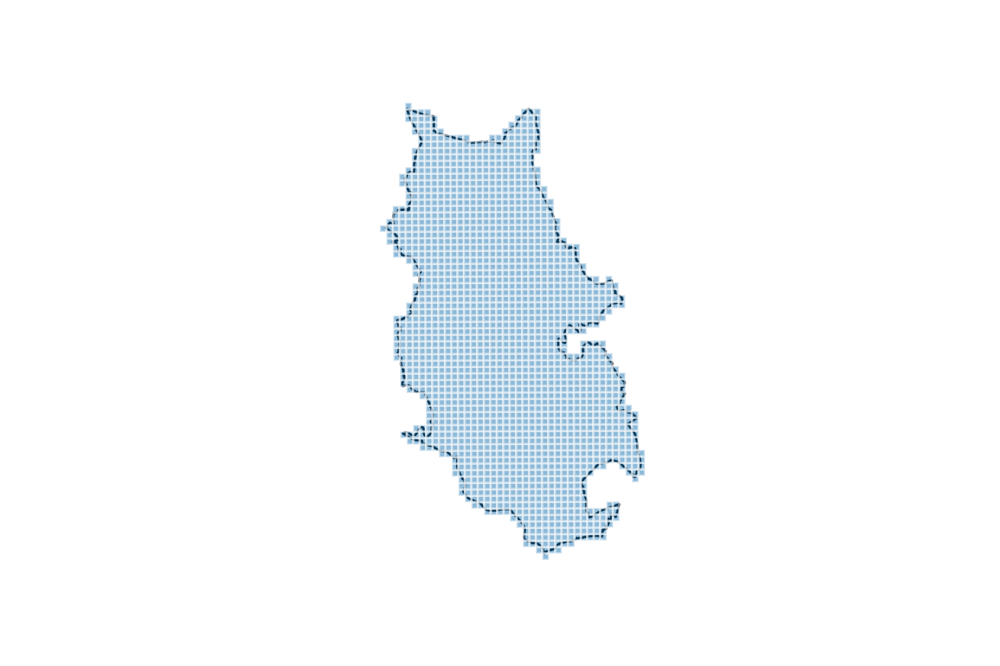

# What3Words Clone With Python, PostgreSQL and PostGIS

## Motivation

[What3Words](https://what3words.com/) is a fantastic app which essentially acts as a reverse geo-coder for a user's location, splitting the globe into a 3 metre mesh and assigning each cell in the mesh a unique, three-word identifier. In this project we're going to create a clone of this using Python and store the mesh and associated word combinations in PostgreSQL and PostGIS. Now, in reality the what3words mesh consists of about 57 trillion cells which is a bit much for an M1 MacBook Air to handle, so we're going to reduce the scope a little (a lot, actually) and focus on the Bury region of England (since that's where I'm from).

## Setting up the Database

Before we start, we need to set up our PostgreSQL database. I already have a database called ```geodb```, so we'll make a new table there within the ```geo_coding``` schema.

```sql
create table geo_coding.what_three_words(
	id serial primary key,
	three_words varchar(255),
	geom geometry('GEOMETRY', 4326) not null,
	created_at timestamp default now()
)

create index geom_geohash_idx
on geo_coding.what_three_words(st_geohash(geom))

cluster geo_coding.what_three_words 
using geom_geohash_idx
```

We've created a table with four columns: an auto-incrementing integer as the primary key, a column to store the three-word identifier for each cell, a geometry column to store the actual cell geometry (with standard WGS84/EPSG:4326 projection), as well as a reference column which is auto-populated on insertion with a timestamp. In addition we've created a clustered index on the ```geom``` column. This makes our querying more efficient by storing spatially correlated rows together on the physical hard disk (see [here](https://postgis.net/workshops/postgis-intro/clusterindex.html) for a good article on this in the PostGIS documentation). Postgres creates a non-clustered index on the primary key column by default, so there's nothing else for us to do to set our table up.

## Setting Up the Environment

Before we start writing our main ETL, let's set up a config module containing our database variables:

```python
# config.py

config = {
    'user': 'postgres',
    'pwd': '<my password>',
    'host': 'localhost',
    'db': 'geodb',
    'schema': 'geo_coding',
    'table': 'what_three_words'
}
```

In addition, let's set up some basic loggingg funtionality which will write to the console and to a dedicated log file:

```python
# logger.py

import logging

logger = logging.getLogger('etl')
logger.setLevel(logging.INFO)

# format output
formatter = logging.Formatter('%(asctime)s - %(name)s'
                              ' - %(levelname)s - %(message)s')

# file handler
fileHandler = logging.FileHandler('../logs/etl.log', mode='w')
fileHandler.setFormatter(formatter)
fileHandler.setLevel(logging.INFO)

# console handler
consoleHandler = logging.StreamHandler()
consoleHandler.setFormatter(formatter)
consoleHandler.setLevel(logging.INFO)

# add handlers
logger.addHandler(fileHandler)
logger.addHandler(consoleHandler)
```

## Creating a Mesh

In order to assign word combinations to places, we first need a grid on which to do it. To create one we'll do the following:

* First, we'll take a geometric boundary and project into a coordinate system measured in metres
* Second, using a specified mesh resolution (i.e. the width of a cell), we'll calculate a bounding box for the polygon
* Third, we'll then create a list of cells (i.e. small, square polygons) which fill the bounding box
* Finally, we'll work out which of those cells intersect the origin geometry which will give us our final mesh

Let's start by creating a helper module of the various functions we'll need. To begin, we'll import the relevant packages:

```python
import geopandas as gpd
from math import ceil, floor
import random
import requests
from shapely import wkt
from shapely.geometry import box
from sqlalchemy import Column, Integer, String, DateTime, MetaData, Table
from sqlalchemy import create_engine
from geoalchemy2 import Geometry
```

As mentioned earlier, we're going to use the boundary of Bury, England which can be downloaded from [here](https://geoportal.statistics.gov.uk/datasets/local-authority-districts-december-2019-boundaries-uk-bfe-1?where=LAD19NM%20%3D%20%27Bury%27), however we'll use the public API to pull the data rather than manually saving it down:

```python
def get_data():
    # get GeoJSON from API
    lad_url = 'https://opendata.arcgis.com/datasets/1d78d47c87df4212b79fe2323aae8e08_0.geojson'
    response = requests.get(lad_url)
    content = response.content

    # read as spatial dataframe
    lad = gpd.read_file(content.decode())
    lad.to_crs('EPSG:27700', inplace=True)

    # extract Bury boundary
    bury_geom = lad[lad.lad19nm == 'Bury']
    return bury_geom.geometry.values[0]
```

Now that we've got our boundary, we can generate the mesh in line with the process described above. We'll opt for a 100m resolution (mainly for performance reasons):

```python
def generate_mesh(geom, res):
    # utility function to round to a given base
    def round_to_base(num, base, direction):
        if direction == 'up':
            return base * ceil(num / base)
        elif direction == 'down':
            return base * floor(num / base)

    # extract bounding points for the polygon and calculate
    # the width and height of the envelope based on the provided
    # grid resolution
    minx, miny, maxx, maxy = geom.bounds

    width = round_to_base(maxx, base=res, direction='up') \
        - round_to_base(minx, base=res, direction='down')

    height = round_to_base(maxy, base=res, direction='up') \
        - round_to_base(miny, base=res, direction='down')

    # calculate number of vertical and horizontal cells
    cells_x = int(width / res)
    cells_y = int(height / res)

    # create a mesh
    mesh = []
    for i in range(cells_x):
        for j in range(cells_y):
            cell = box(
                round_to_base(minx, base=res, direction='down')
                + (i * res),
                round_to_base(miny, base=res, direction='down')
                + (j * res),
                round_to_base(minx, base=res, direction='down')
                + ((i + 1) * res),
                round_to_base(miny, base=res, direction='down')
                + ((j + 1) * res))
            mesh.append(cell)

    return mesh
```

Next we need to restrict the mesh to the boundary of our starting polygon and to do this we'll essentially pull out cells from the mesh which intersect the original geometry:

```python
def overlay_mesh(geom, mesh):
    # extract cells which intersect the main polygon
    return [cell for cell in mesh if cell.intersects(geom)]
```

If we plot the mesh along with the original polygon we get a better idea of how the reverse geo-coding works:



Now that we've got our mesh, we need words to assign to the cells in it. Luckily, we can use [this](https://www.mit.edu/~ecprice/wordlist.10000) open-source list from MIT:

```python
def get_words():
    # create a list of 5 letter words
    word_url = 'https://www.mit.edu/~ecprice/wordlist.10000'
    all_words = requests.get(word_url).text
    return [word for word in all_words.split('\n') if len(word) == 5]
```

A big list of words isn't much use on its own, we need to create combinations:

```python
def create_words_combos(words, num_combos):
    combos = []
    for i in range(num_combos):
        # parse combo
        combo = f'{random.choice(words)}' \
                f'.{random.choice(words)}' \
                f'.{random.choice(words)}'
     
        # make sure we don't have duplicate combinations
        if combo in combos:
            i -= 1
        else:
            combos.append(combo)
```

Finally, we can construct a spatial dataframe of grid squares and their corresponding three-word encoding:

```python
def construct_dataframe(overlayed_mesh, combos):
    what3words = gpd.GeoDataFrame({'geometry': cell}
                                  for cell in overlayed_mesh)
    what3words['three_words'] = combos

    # convert projection
    what3words.set_crs('EPSG:27700', inplace=True)
    what3words.to_crs('EPSG:4326', inplace=True)
    return what3words
```
